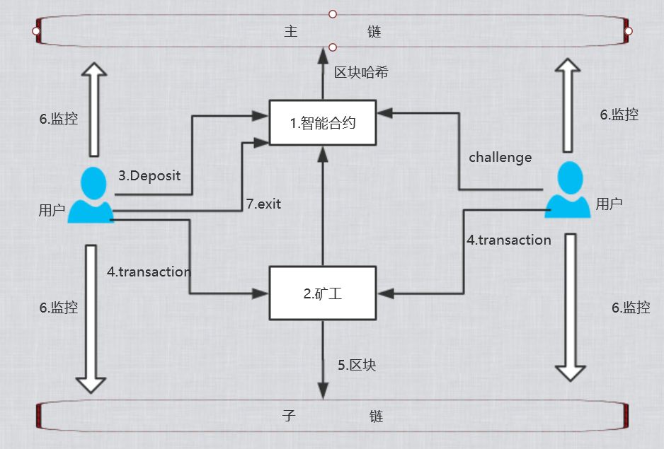


流程如下：

1.用户向主链上的 Plasma 合约发送token。

2.合约收到 Deposit 交易后，主链上的资产锁定，并在子链上创建跟 Deposit 数额一致的交易，将其打包进区块中，作为存款确认的证明。同时打包给矿工。 

3.用户发送交易(包括Deposit产生的交易)给矿工，当积累到一定数量，由矿工打包成区块。采用UTXO模型。

4.当用户想要退出子链时，需要向合约发送一个exit交易，申请中需要包含如下：

      (1)所要退出的 UTXO 的位置(区块号、区块内交易号以及交易内输出号)

      (2)包含该 UTXO 的交易

      (3)该交易的 Merkle Proof

      (4)用于生成该 UTXO 所涉及的之前一系列交易的确认签名。

      exit 交易中还要包含退出押金。如果这个exit交易被 challenge 成功，
      那么取款的操作将被取消，而且退出押金将被发送给提出 challenge 的用户。

5. 每个exit操作都会经历一个challenge。如果其他用户发现有恶意行为发生，可

   以提出一个challenge，需要给出针对的 UTXO 的位置，以及该 UTXO 被花费的证明

6. 为了保证子链上资产的安全，用户需要周期性地检查子链上的数据，保证没有恶意交易产生。用户需要运行类似钱包的软件，每隔一段时间下载子链中的区块数据，检查每个区块中的交易，如果有恶意交易产生，立即发起exit操作。

7. 主链上只存子链上区块的Hash，其余的都在子链存储。子链的用户有以下几种存在模式
  
   (1)  全节点用户

   (2)  SPV用户

   (3)  分布式存储方式，即子链区块里面存的是Hash索引，数据分片后分散到不同的用户节点上，每个用户只有部分数据，但是却有全部数据的Hash集合列表，需要数据的时候，根据Hash集合列表里面的索引，来获取数据。这个与IPFS的方式很类似。

 

 
